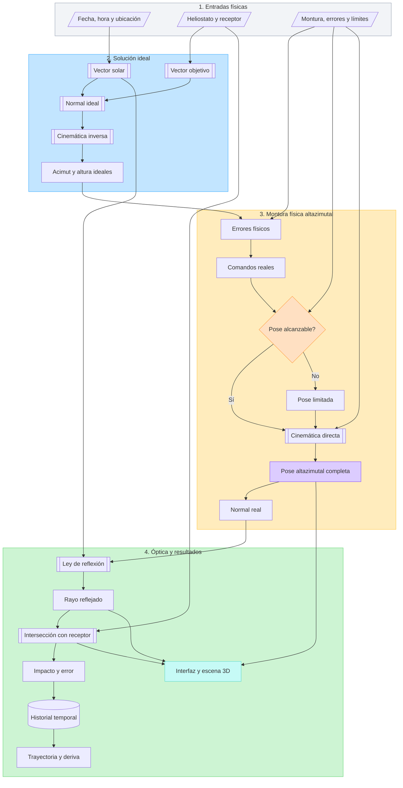

# Diseño del núcleo físico v2 del simulador web

**Estado:** borrador técnico para revisión  
**Fecha:** 18 de agosto de 2026  
**Alcance:** definir la física, la cinemática y la estrategia de desarrollo antes de modificar la aplicación.

## 1. Objetivo

Reemplazar progresivamente la lógica física difícil de auditar por un núcleo matemático explícito y comprobable, sin rediseñar la interfaz gráfica existente ni retirar ninguna de sus funciones.

La aplicación web actual se conservará como versión estable mientras se desarrolla la versión física v2 de manera aislada.

## 2. Decisiones confirmadas

1. El mini horno utiliza una montura altazimutal.
2. Tiene dos motores independientes:
   - motor de acimut alrededor del eje vertical;
   - motor de altura solar alrededor de un eje horizontal.
3. Aunque los motores sean independientes, la cinemática es serial: el eje horizontal de altura es transportado por la rotación de acimut.
4. La arista inferior del espejo cuadrado debe permanecer paralela al suelo durante toda la operación.
5. La normal del espejo no basta para definir su pose completa: también debe fijarse el giro alrededor de la propia normal.
6. La interfaz, los menús, los controles, las gráficas, las exportaciones y las funciones actuales deben mantenerse.
7. La escena 3D se simplificará a una base con un solo tubo central y los dos ejes de movimiento claramente representados.
8. Los límites solares y mecánicos formarán parte del modelo físico.
9. La matemática v2 comenzará en un solo archivo Python, provisionalmente `web_app/physics_core.py`.
10. La deriva deberá surgir de la evolución temporal del modelo físico; no se impondrá como una trayectoria gráfica.
11. El acimut positivo apunta hacia el oeste y el movimiento positivo de altura eleva el heliostato.
12. Los límites de acimut son `-90°` al este y `+90°` al oeste.
13. Los límites de altura son `10°` (casi vertical) y `90°` (espejo horizontal y posición Home).
14. Al alcanzar un límite, el eje correspondiente se detendrá y la aplicación mostrará una señal o etiqueta de límite alcanzado.

## 3. Requisitos congelados de la interfaz

Durante el desarrollo del núcleo v2 no se modificarán:

- organización de menús y pestañas;
- nombres y ubicación de controles;
- modos de operación actuales;
- reloj, pausa, reanudación y replay;
- gráficas y diagnósticos;
- exportación CSV y paquete experimental;
- selección y análisis de facetas;
- estrategias de corrección existentes;
- ayuda y contenido educativo.

La futura modificación de `web_app/www/twin3d.js` se limitará a la geometría y cinemática de la escena 3D: tubo central, jerarquía de los dos ejes, pose del espejo y extensión de los rayos. No deberá alterar el menú ni la interacción general de la aplicación.

## 4. Convenciones geométricas

### 4.1 Sistema global

Se conserva la convención ya utilizada por el proyecto:

- `+x`: oeste;
- `+y`: sur;
- `+z`: cenit;
- plano del suelo: plano `xy`;
- vector vertical: `k = (0, 0, 1)`;
- acimut `0°`: sur;
- acimut `+90°`: oeste;
- acimut `-90°`: este;
- altura solar `0°`: horizonte;
- altura solar `+90°`: cenit.

Con esta convención, un vector definido por acimut `A` y altura `h` es:

```text
v = (cos(h) sin(A), cos(h) cos(A), sin(h))
```

Todos los vectores direccionales empleados por la óptica deberán normalizarse explícitamente.

### 4.2 Referencias, sentidos y límites de los motores

La expresión "cero mecánico" se reemplaza por **referencia de homing**, para distinguir entre la lectura del encoder, la referencia física y el ángulo mostrado por la aplicación.

| Eje | Referencia angular | Sentido positivo | Límite mínimo | Límite máximo | Home |
|---|---|---|---:|---:|---|
| Acimut | `0°` apunta al sur | Hacia el oeste | `-90°` este | `+90°` oeste | `0°` sur |
| Altura | `90°` representa el espejo horizontal | Movimiento que eleva el heliostato | `10°` casi vertical | `90°` horizontal | `90°` horizontal |

En el eje de altura, el cero matemático no necesita ser alcanzable. El homing se realizará en la posición horizontal y esa posición se etiquetará como `90°`.

Al alcanzar cualquier límite:

1. se detendrá el motor de ese eje;
2. no se permitirán comandos que continúen más allá del límite;
3. el otro eje podrá continuar funcionando si su movimiento sigue siendo válido;
4. el estado incluirá `limite_acimut_este`, `limite_acimut_oeste`, `limite_altura_minimo` o `limite_altura_home`;
5. la interfaz mostrará una señal o etiqueta visible de límite alcanzado.

### 4.3 Jerarquía cinemática altazimutal

La pose visual y matemática deberá usar la siguiente jerarquía:

```text
suelo
└── tubo central y eje vertical
    └── conjunto de acimut
        └── eje horizontal de altura
            └── espejo
```

La transformación se aplica en este orden:

1. rotación de acimut alrededor del eje vertical global;
2. rotación de altura alrededor del eje horizontal local transportado por el acimut;
3. transformación fija entre el eje de altura y el plano del espejo, si la geometría mecánica la requiere.

Las rotaciones no deben intercambiarse. Tampoco se orientará el espejo directamente alineando un plano libre con la normal calculada.

### 4.4 Condición de la arista inferior horizontal

Sea `n` la normal unitaria del espejo y `k` el vector vertical. Para una pose no singular puede construirse una base del espejo mediante:

```text
e = unit(k × n)
p = unit(n × e)
```

donde:

- `e` es la dirección de las aristas inferior y superior;
- `p` apunta hacia la parte superior del espejo dentro de su propio plano;
- `n` es la normal del espejo.

La base debe satisfacer:

```text
e · k = 0        la arista es horizontal
e · n = 0        la arista pertenece al plano del espejo
p · n = 0        la dirección vertical del espejo pertenece a su plano
e × p = n        la base conserva orientación consistente
```

Para un espejo cuadrado de lado `L` y centro `c`:

```text
centro_arista_inferior = c - (L / 2) p
centro_arista_superior = c + (L / 2) p
```

La dirección `e` tiene dos signos posibles. Se escogerá el signo compatible con el acimut de la montura y con la pose anterior para evitar que el espejo gire `180°` entre dos instantes consecutivos.

Cuando `n` sea paralela a `k`, el producto `k × n` se anula y todas las aristas posibles son horizontales. En ese caso singular se conservará la orientación horizontal determinada por el conjunto de acimut o por la última pose válida.

Esta construcción deberá ser una consecuencia directa de la jerarquía altazimutal. La fórmula sirve para construir o verificar la base completa del espejo, pero no será una corrección visual aplicada después del movimiento de los dos ejes.

### 4.5 Geometría del perfil Minihorno IER

La versión v2 conservará inicialmente las dimensiones físicas completas del perfil que ya utiliza la aplicación web:

- altura del pivote o centro de giro del espejo: `2.20 m` sobre el suelo;
- centro del receptor relativo al centro óptico del heliostato: `R = (0.00, 5.55, -0.40) m`;
- interpretación de `RZ=-0.40 m`: el receptor está `0.40 m` por debajo del centro óptico del heliostato, no por debajo del suelo;
- plano receptor: pasa por `R` y es perpendicular a la dirección que une el centro óptico del heliostato con el centro del receptor;
- eje local `u` del receptor: horizontal y positivo hacia el oeste;
- eje local `v` del receptor: positivo hacia el cenit.

Los documentos preliminares también registran `R=(0, 5.55, -0.35) m`, mientras el perfil activo emplea `RZ=-0.40 m`. Para conservar el comportamiento actual de la aplicación, v2 partirá de `-0.40 m`; la diferencia de `0.05 m` deberá quedar identificada como calibración del perfil, no como un cambio silencioso.

Estas dimensiones corresponden al perfil físico completo del Minihorno IER. No deben confundirse con la maqueta impresa reducida, cuyos documentos preliminares manejan un pivote de `0.18–0.22 m` y un receptor cercano a `0.47 m`.

## 5. Diagrama de flujo matemático



## 6. Pseudocódigo del ciclo físico

```text
recibir configuración física
validar unidades, ubicación, receptor, montura y límites

para cada instante de simulación:

    calcular posición solar
    calcular vector solar unitario

    si el Sol está fuera del intervalo operativo:
        marcar seguimiento solar no disponible
        detener o conservar la pose según el modo definido
        registrar la causa
        actualizar salidas sin inventar una posición solar válida
        continuar

    calcular vector unitario hacia el receptor nominal
    calcular normal ideal del espejo

    resolver cinemática inversa altazimutal:
        obtener acimut ideal
        obtener altura ideal

    aplicar errores en su ubicación física:
        offset de referencia o encoder
        inclinación del pedestal
        backlash con estado previo explícito
        otros errores habilitados

    evaluar límites mecánicos de acimut y altura

    si la pose solicitada no es alcanzable:
        detener el eje en el límite correspondiente
        impedir comandos que avancen más allá del límite
        emitir el estado o etiqueta de límite alcanzado

    resolver cinemática directa altazimutal:
        rotar el conjunto superior alrededor del eje vertical
        transportar el eje horizontal de altura
        rotar el espejo alrededor del eje horizontal local

    construir la base completa del espejo:
        normal real
        dirección de la arista inferior
        dirección hacia la parte superior del espejo

    verificar:
        norma de los vectores igual a uno
        ortogonalidad de la base
        arista inferior paralela al suelo
        continuidad respecto del instante anterior

    calcular el rayo reflejado mediante la normal real
    calcular la intersección del rayo con el plano receptor

    si la intersección es válida:
        calcular coordenadas u y v
        calcular error radial respecto del objetivo
    de lo contrario:
        registrar que el rayo no alcanza el receptor

    guardar resultados del instante
    actualizar la interfaz existente con los resultados calculados
    actualizar la escena 3D con la misma pose física
```

## 7. Alcance inicial de `physics_core.py`

El archivo contendrá funciones matemáticas puras o funciones cuyo estado previo se entregue de forma explícita. No tendrá dependencias de Shiny ni de la escena 3D.

### 7.1 Operaciones vectoriales y geométricas

```python
np.add(...), np.subtract(...), np.dot(...), np.cross(...)
np.linalg.norm(...)
_vector_array(...)
_unit_vector_array(...)
_array_to_vector(...)
angle_between(...)
rotate_about_axis(...)
```

Las operaciones elementales no forman parte de la API pública del núcleo. Los
arreglos se validan una vez al entrar a cada función física y permanecen como
NumPy durante el cálculo; solo se convierten a tupla al devolver resultados.

### 7.2 Geometría solar y óptica ideal

```python
solar_position(...)
solar_vector(...)
target_direction(...)
ideal_heliostat_normal(...)
reflected_direction(...)
```

### 7.3 Cinemática altazimutal

```python
altaz_commands_from_normal(...)
altaz_pose_from_commands(...)
mirror_basis_from_altaz_pose(...)
validate_mirror_basis(...)
```

La salida de la pose deberá contener, como mínimo:

```text
acimut real
altura real
normal del espejo
dirección de la arista inferior
dirección hacia la parte superior
matriz o cuaternión de orientación
estado de límites
```

### 7.4 Receptor e impacto

```python
receiver_frame(...)
ray_plane_intersection(...)
impact_coordinates(...)
radial_spot_error(...)
```

### 7.5 Errores y restricciones

```python
apply_encoder_offset(...)
apply_pedestal_tilt(...)
apply_backlash(previous_state, command, parameters)
apply_receiver_position_error(...)
apply_canting_error(...)
sun_is_operational(...)
apply_mechanical_limits(...)
```

Un error no se añadirá automáticamente a la normal. Cada error deberá aplicarse a la variable física que realmente modifica.

## 8. Estrategia para conservar v1 y desarrollar v2 sin interferencia

No se mantendrán dos núcleos de cálculo dentro de la misma ejecución de la aplicación. Se conservarán dos versiones mediante Git y dos carpetas de trabajo independientes.

### 8.1 Versión estable

- Rama: `main`.
- Punto de referencia actual: commit `b37d7be`.
- Carpeta actual: `tmp/simulador-horno-solar-web`.
- Publicación: GitHub Pages.
- Regla: no desarrollar v2 directamente aquí.

Se creó la etiqueta local inmutable `web-v0.4.0-stable` sobre el commit `b37d7be` antes de comenzar la implementación.

### 8.2 Versión física v2

- Rama: `codex/nucleo-fisico-v2`.
- Carpeta paralela: `tmp/simulador-horno-solar-web-v2`.
- Implementación: un `git worktree` asociado exclusivamente a la rama v2.
- Publicación: ninguna mientras esté en desarrollo.

El flujo de GitHub Pages actual se activa únicamente con cambios en `main`. Por eso la rama v2 y su carpeta paralela no sustituirán la versión pública ni modificarán el directorio estable.

### 8.3 Finalización

La v2 podrá sustituir a la versión estable solamente cuando cumpla:

1. pruebas matemáticas aprobadas;
2. cinemática altazimutal validada;
3. arista inferior horizontal en todo el dominio operativo;
4. límites solares y mecánicos implementados;
5. errores físicos validados por separado;
6. conservación de interfaz y funciones;
7. exportaciones compatibles o migración documentada;
8. validación visual y revisión del equipo.

Después de fusionar v2, la versión anterior seguirá siendo recuperable mediante la etiqueta y el historial de Git. No será necesario conservar indefinidamente código duplicado dentro del programa.

## 9. Matriz inicial de trazabilidad

| Fenómeno o requisito | Código actual | Evaluación inicial | Acción v2 | Validación requerida |
|---|---|---|---|---|
| Convención global | `digital_twin/error_model.py` | Define `+x` oeste, `+y` sur, `+z` cenit | Conservar y centralizar | Pruebas de signos y ejes |
| Operaciones vectoriales | `web_app/engine.py` | Existen, mezcladas con estado del motor | Mover a `physics_core.py` | Casos analíticos y vectores nulos |
| Posición solar | `solar_position_db()` | Aproximación propia con modos D&B/REDA | Sustituir por adaptadores explícitos de `pvlib`: D&B analítico y NREL SPA (Reda-Andreas) | Casos numéricos de referencia y equivalencia entre entradas SPA |
| Vector solar | `_solar_geometry()` | Se construye con la convención global | Extraer como función pura | Casos conocidos por fecha y ubicación |
| Normal ideal | `compute_heliostat_normal()` | Usa bisectriz normalizada | Extraer y documentar | Ley de reflexión y casos simétricos |
| Normal a ángulos | `angles_from_normal()` | Trata la normal como orientación suficiente | Reemplazar por cinemática inversa altazimutal | Reconstrucción y continuidad |
| Ángulos a normal | `normal_from_angles()` y `ErrorModel.normal_from_command()` | Suma errores angulares | Reemplazar por cinemática directa | Comparar pose, normal y ejes físicos |
| Arista inferior horizontal | No está modelada | Incumplida en la escena actual | Construir base completa del espejo | `abs(e · k) < tolerancia` en toda la trayectoria |
| Reflexión | `reflect_vector()` | Fórmula vectorial identificable | Extraer y documentar signos | Incidencia normal y ángulos simétricos |
| Receptor | `target_frame()` y `target_impact()` | Intersección rayo-plano existente | Extraer y definir plano explícito | Casos analíticos, paralelo y detrás del origen |
| Offset angular | `ErrorModel.angular_errors()` | Se suma directamente a acimut o altura | Definir como error de referencia o encoder | Error conocido y efecto temporal |
| Inclinación del pedestal | Aproximada como suma angular | No representa el eje vertical real inclinado | Transformar el marco de la montura | Casos con inclinación en dos direcciones |
| Backlash | `ErrorModel.sample_motion()` | Usa sentido de movimiento | Conservar concepto con estado explícito | Inversión de sentido y zona muerta |
| Deriva | Tasas configurables en `_solar_geometry()` | Puede imponerse en grados por hora | Separar de la deriva física emergente | Trayectorias temporales con error constante |
| Límites mecánicos | Valores en el perfil y `clamp()` | Los valores anteriores eran provisionales | Usar acimut `[-90°, +90°]` y altura `[10°, 90°]`; detener y señalizar | Bordes, fuera de rango y recuperación |
| Disponibilidad solar | No gobierna el seguimiento | Puede simular con Sol bajo horizonte | Incorporar intervalo operativo | Amanecer, anochecer y frontera |
| Pose 3D | `twin3d.js:addHeliostat()` | Alinea el espejo directamente con la normal | Usar jerarquía acimut-altura | Arista horizontal y coincidencia con Python |
| Soporte 3D | `twin3d.js:addHeliostat()` | Base, patas y horquilla complejas | Simplificar a tubo central y ejes | Revisión visual |
| Interfaz y funciones | `web_app/app.py` | Base funcional que debe preservarse | No rediseñar | Lista de funciones y comparación visual |
| Exportaciones | `WebTwinState` y `app.py` | CSV y paquete ya operativos | Mantener contrato inicialmente | Pruebas de columnas y archivos |

## 10. Pruebas mínimas de la cinemática

1. La dirección de la arista inferior tiene componente vertical cero.
2. La arista inferior es perpendicular a la normal.
3. La base del espejo es ortonormal.
4. La pose es continua al variar acimut y altura en pasos pequeños.
5. El motor de acimut rota todo el conjunto superior alrededor del eje vertical.
6. El motor de altura rota el espejo alrededor del eje horizontal local.
7. Mover solamente acimut no cambia la altura ordenada.
8. Mover solamente altura no cambia el acimut ordenado.
9. Los límites de un eje no alteran de forma silenciosa el otro eje.
10. La cinemática inversa seguida de la directa recupera la normal alcanzable.
11. La escena JavaScript utiliza la misma base o cuaternión producido por Python.
12. El caso singular con normal vertical no provoca saltos de `180°`.
13. Los comandos de acimut se detienen exactamente en `-90°` y `+90°` y emiten el estado correspondiente.
14. Los comandos de altura se detienen exactamente en `10°` y `90°` y emiten el estado correspondiente.
15. La posición Home resulta en acimut `0°` y altura `90°` sin sobrepasar los límites.

## 11. Parámetros físicos confirmados y pendientes

Quedan confirmados:

- referencia de acimut: `0°` hacia el sur;
- acimut positivo hacia el oeste;
- límites de acimut: `-90°` este y `+90°` oeste;
- Home de altura: `90°`, espejo horizontal;
- sentido positivo de altura: movimiento que eleva el heliostato;
- límites de altura: `10°` casi vertical y `90°` horizontal;
- comportamiento en límites: detener el eje y mostrar señal o etiqueta;
- altura del pivote en el perfil web: `2.20 m`;
- posición del receptor del perfil web: `(0.00, 5.55, -0.40) m` respecto del centro óptico;
- orientación del receptor: plano perpendicular a la dirección heliostato-receptor, con `u` hacia el oeste y `v` hacia el cenit;
- la arista inferior horizontal es una propiedad de la cinemática altazimutal y deberá cumplirse por construcción.

Como regla inicial para la altura solar:

- el seguimiento será físicamente inválido cuando la altura solar sea menor o igual que `0°`;
- se conservará un parámetro separado `altura_solar_min_operativa_deg`, inicialmente en `0°`;
- ese parámetro podrá aumentarse después de medir sombras, obstrucciones o baja utilidad óptica, sin modificar las ecuaciones solares.

## 12. Orden de ejecución acordado

1. Revisar y aprobar este documento.
2. Completar los datos físicos pendientes.
3. Crear la etiqueta estable, rama v2 y carpeta de trabajo paralela.
4. Crear `physics_core.py` y sus pruebas sin conectarlo a la interfaz.
5. Validar operaciones vectoriales, posición solar y óptica ideal.
6. Validar cinemática altazimutal y arista inferior horizontal.
7. Validar reflexión e intersección con el receptor.
8. Incorporar errores uno por uno.
9. Incorporar disponibilidad solar y límites mecánicos.
10. Conectar el núcleo v2 con la interfaz existente.
11. Simplificar únicamente la representación del soporte 3D.
12. Extender los rayos hasta el receptor.
13. Ejecutar pruebas funcionales, matemáticas y visuales.
14. Revisar la v2 antes de decidir su fusión en `main`.

## 13. Estado de implementación

### 18 de agosto de 2026

- Creada la etiqueta local `web-v0.4.0-stable` sobre el commit estable `b37d7be`.
- Creada la rama aislada `codex/nucleo-fisico-v2`.
- Creado el worktree paralelo `tmp/simulador-horno-solar-web-v2`.
- Creado `web_app/physics_core.py`, todavía sin conexión con Shiny ni JavaScript.
- Implementadas funciones puras de vectores, ángulos, óptica ideal, cinemática altazimutal, receptor, offsets y límites.
- Añadidos NumPy y SciPy para álgebra vectorial y rotaciones, y `pvlib==0.15.2` para el núcleo solar.
- Eliminadas de la API las funciones redundantes de suma, resta, escala, producto punto, producto cruz y norma. Las funciones físicas usan directamente arreglos y operaciones NumPy; la conversión a tupla ocurre solo en sus resultados.
- La rotación tridimensional se delega a `scipy.spatial.transform.Rotation`.
- La posición solar ya no usa fórmulas propias: Duffie-Beckman utiliza las rutinas analíticas de `pvlib`; REDA llama directamente a `spa_python`; SPA/PVLIB usa `get_solarposition(method="nrel_numpy")`.
- REDA y SPA/PVLIB están documentados como dos entradas al mismo algoritmo NREL SPA, no como modelos independientes.
- Creado `docs/fundamentos_matematicos_physics_core.md` con las ecuaciones de vectores, cinemática, óptica, receptor y posición solar que fundamentan el núcleo.
- Creado `web_app/test_physics_core.py` con 25 pruebas nuevas.
- Resultado conjunto: 42 pruebas correctas, incluyendo las 17 pruebas preexistentes de la aplicación.
- La aplicación estable y su interfaz permanecen sin modificaciones.

### 24 de agosto de 2026

- Creado `web_app/physics_pipeline.py` como orquestador puro de un instante físico, sin conexión con Shiny, JavaScript ni la escena 3D.
- Definidas entradas y resultados inmutables que conservan posición solar, comandos ideales, offsets, límites, pose real, reflexión e impacto.
- El flujo se detiene explícitamente cuando el Sol no supera la altura mínima y no genera comandos ni impactos ficticios.
- Los offsets y límites se aplican antes de reconstruir la pose real; la reflexión utiliza esa pose alcanzable y no la normal ideal.
- Creado `web_app/test_physics_pipeline.py` con 11 pruebas integrales de geometría, cierre óptico, noche, umbral solar, saturaciones, singularidad Home, métodos solares y continuidad temporal.
- Resultado conjunto actualizado: 53 pruebas correctas, incluyendo las 17 pruebas preexistentes de la aplicación.
- La interfaz existente continúa sin modificaciones.

### 24 de agosto de 2026 — compatibilidad web

- Creada `web_app/shinylive_smoke_app.py`, una miniaplicación independiente que ejecuta el núcleo completo dentro del navegador.
- Creado el requisito Shinylive fijado para instalar `pvlib==0.15.2` mediante `micropip`.
- Declaradas explícitamente las dependencias transitivas que el export reducido debe copiar desde el catálogo Pyodide.
- Verificados dentro de CPython/Pyodide 3.12.7 los métodos REDA, SPA y Duffie-Beckman con impacto centrado.
- Resultado visible del navegador: `RESULTADO: PASS`, sin errores de consola del núcleo físico.
- Creada `web_app/test_shinylive_smoke.py`; resultado conjunto actualizado: 54 pruebas correctas.
- Documentadas versiones, tiempos, tamaño y dependencia de red en `docs/compatibilidad_shinylive_physics_v2.md`.
- La interfaz principal, el motor estable y la escena 3D permanecen sin modificaciones.

### 25 de agosto de 2026 — exportación autocontenida

- Adoptada la distribución de la rueda de `pvlib==0.15.2` junto con el sitio, en lugar de descargarla desde PyPI durante la primera visita.
- Creado `web_app/export_shinylive_smoke.py` para descargar la rueda oficial solo cuando falta, verificar su SHA-256, preparar los archivos canónicos y generar el export Shinylive.
- El requisito usa una URI `site:` que el postproceso convierte en una URL del mismo servidor.
- Verificado en navegador que la instalación proviene de la rueda incorporada y que no existen solicitudes a `pypi.org` ni a `pythonhosted.org`.
- Resultado visible autocontenido: `RESULTADO: PASS` para REDA, SPA y Duffie-Beckman dentro de CPython/Pyodide 3.12.7.
- Creado `web_app/test_export_shinylive_smoke.py`; resultado conjunto actualizado: 57 pruebas correctas.
- La rueda se publica separada de `app.json` para evitar Base64 y mejorar su caché; los artefactos grandes permanecen ignorados por Git.
- La interfaz principal, el motor estable y la escena 3D continúan sin modificaciones.

### 25 de agosto de 2026 — integración completa V2

- Creado `web_app/physics_adapter.py` como frontera tipada entre el estado histórico y `physics_pipeline.py`.
- La API histórica de posición solar delega ahora en los métodos exactos de `physics_core.py`; se eliminó su uso efectivo de la aproximación anterior.
- Conectada `WebTwinState._solar_geometry()` al adaptador V2 sin cambiar el contrato de historial ni el CSV de 166 columnas.
- Confirmados en la aplicación los límites de acimut `[-90°, 90°]` y de altura `[10°, 90°]`, con saturación independiente, estado visible y evento al alcanzar una frontera.
- Corregida la validación de la pose para evitar la amplificación numérica de `arccos` en ángulos intermedios válidos.
- La escena 3D recibe normal, arista horizontal y dirección superior; el espejo se orienta con la base completa y conserva la arista inferior paralela al suelo.
- Simplificado el soporte a un tubo central con los dos ejes físicos visibles.
- Extendido el rayo reflejado hasta la intersección con el receptor.
- Creado `web_app/export_shinylive_app.py` y actualizado el despliegue para incluir adaptador, núcleo, pipeline, dependencias Pyodide y la rueda estática verificada.
- Resultado principal en navegador: movimiento fluido, cierre `EN OBJETIVO`, error radial observado de `0.73 mm` y arista con componente vertical `0`.
- Resultado de compatibilidad Pyodide: `PASS` para REDA, SPA y Duffie-Beckman, sin accesos a PyPI durante la visita.
- Resultado conjunto actualizado: 69 pruebas correctas.

### Cierre de recursos 3D y prueba de navegador

- Three.js r180, `OrbitControls` y `three.core.min.js` se alojan bajo
  `web_app/www/vendor/three/`, con licencia MIT y huella SHA-512 del paquete.
- La escena dejó de importar código desde `esm.sh`.
- `web_app/e2e_browser.py` prueba automáticamente la exportación Shinylive y la
  aplicación Shiny directa en Chrome.
- El recorrido automatizado valida Home, movimientos independientes hacia
  oeste y abajo, lienzo WebGL y arista inferior horizontal.
- Resultado conjunto actualizado: 73 pruebas unitarias correctas y prueba de
  navegador `PASS`.
- La versión estable continúa protegida en `main`; no se ha realizado fusión ni publicación.
